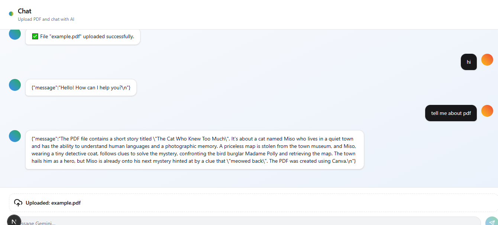

# PDF Chat AI Service

Intelligent chat over uploaded PDF documents using state-of-the-art vector search, embeddings, and Google Gemini LLMs. Upload your PDF, ask questions, and get context-aware answers—powered by scalable job queues and embeddings storage.

## Backend Repository

- [Pdfchatbackend on GitHub](https://github.com/rafayy2codes/Pdfchatbackend)

## Features

- **PDF Upload**: Upload PDF files via REST endpoint.
- **Asynchronous Processing**: Uses BullMQ to queue and process heavy PDF parsing and vectorization jobs off the main thread.
- **Document Chunking & Embedding**: Splits PDFs into overlapping chunks and generates embeddings using Google Gemini models.
- **Vector Search**: Stores and retrieves embeddings from Qdrant, a high-performance vector database.
- **Conversational AI**: Chat endpoint answers questions by retrieving the most relevant PDF chunks and using Gemini LLM to generate responses.
- **Scalable & Modular**: Built with extensibility and high concurrency in mind.

---

---

---

## How It Works

1. **PDF Upload**:  
   - User uploads a PDF (`POST /upload/pdf`).
   - File is saved and a job is queued for background processing.

2. **Background Processing**:  
   - Worker picks up the job, loads the PDF, splits it into chunks, and generates vector embeddings using Gemini.
   - Chunks are stored in Qdrant vector database.

3. **Chat/QA**:  
   - User sends a question (`GET /chat?message=...`).
   - Relevant chunks retrieved from Qdrant using vector similarity.
   - System composes a prompt with retrieved context and sends it to Gemini LLM.
   - AI response is returned to the user.

---

